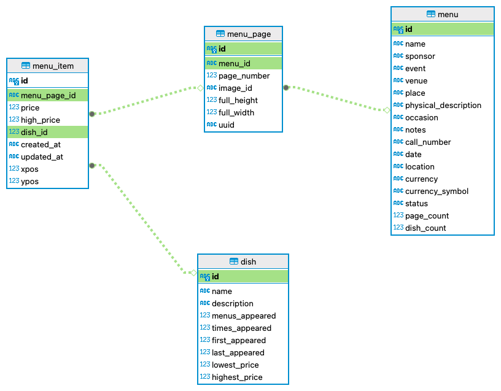

# CS 513 Group Project Phase 1

## Dataset Description
This project adopts historical restaurant menu data provided by New York Public Library. This dataset collects approximately 1335511 dishes in 17562 menus from 1850s to 2000s. There are four relations with following relationships.

### Menu
There are 17 columns in menu relation. Altogether they illustrate
- the location(LOCATION & PLACE) and phone number(CALL_NUMBER) of the restuarant(SPONSOR & NAME)
- events(EVENT) this resturant serves
- number of dishes(DISH_COUNT) listed on menu
- shape and size(PHYSICAL_DESCRIPTION) and number of pages of the physical menu book(PAGE_COUNT)
- the date(DATE) this menu book was collected

### Menu Page
There are 7 columns in menu_page relation. Altogether they illustrate
- the menu book(MENU_ID) current page(page_number) belongs to 
- size(FULL_HEIGHT & FULL_WEIGHT) of the physical page
- the digital image(IMAGE_ID) of this page. For example, here is an [image](https://menus.nypl.org/menu_pages/41519)

### Menu Item
There are 8 columns in menu_item relation. Altogether they illustrate
- the page(PAGE_NUMBER) this item is on and the (x, y)(XPOS & YPOS) coordinate on the page
- datetime this item was created(CREATED_AT) and updated(UPDATED_AT)
- price(price) of the dish(DISH_ID) this item refers to

The definition of column HIGH_PRICE is unknown.

### Dish
There are 9 columns in dish relation. Altogether they illustrate
- name(NAME) and description(DESCRIPTION) of this dish
- number of menus(MENUS_APPEARED) this dish appears
- how many times(TIMES_APPEARED) this dish appears
- price range of this dish(LOWEST_PRICE & HIGHEST_PRICE)
- life span of this dish(FIRST_APPEARED & LAST_APPEARED)